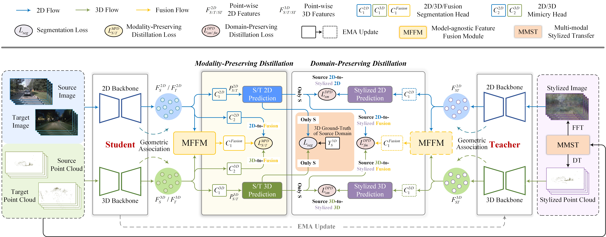

# **Cross-modal Unsupervised Domain Adaptation for 3D Semantic Segmentation via Bidirectional Fusion-then-Distillation [ACM MM 2023 Oral]**

This is the official PyTorch implementation of our work.

> [**Cross-modal Unsupervised Domain Adaptation for 3D Semantic Segmentation via Bidirectional Fusion-then-Distillation**](https://doi.org/10.1145/3581783.3612013)       
> [Yao Wu](https://scholar.google.com.hk/citations?user=QYbmS-YAAAAJ&hl=zh-CN), Mingwei Xing, Yachao Zhang, Yuan Xie, Jianping Fan, Zhongchao Shi, Yanyun Qu  
> *Published in: Proceedings of the 31st ACM International Conference on Multimedia (ACM MM), 2023.*

## Overview


## Getting Started

### Installation

The implementation runs on
- Python 3.8
- Torch 1.9.0
- Torchvision 0.10.0
- CUDA 11.1
- [SparseConvNet](https://github.com/facebookresearch/SparseConvNet)
- [nuscenes-devkit](https://github.com/nutonomy/nuscenes-devkit)

### Preparation
As 3D network we use SparseConvNet. We advise to create a new conda environment for installation. PyTorch and CUDA can be installed, and SparseConvNet installed/compiled as follows:
```
pip install --upgrade git+https://github.com/facebookresearch/SparseConvNet.git
```

### Dataset (Refer to [xMUDA](https://github.com/valeoai/xmuda))
You need to perform preprocessing to generate the data for BFtD-xMUDA.

NuScenes:
- Please download the Full dataset (v1.0) from the [NuScenes website](https://www.nuscenes.org/) and extract it.
- Please edit the script xmuda/data/nuscenes/preprocess.py as follows and then run it.
  - ```root_dir``` should point to the root directory of the NuScenes dataset.
  - ```out_dir``` should point to the desired output directory to store the pickle files.

A2D2:
- Please download the Semantic Segmentation dataset and Sensor Configuration from the [Audi website](https://www.a2d2.audi/a2d2/en/download.html) or directly use ```wget``` and the following links, then extract.
- Please edit the script xmuda/data/a2d2/preprocess.py as follows and then run it.
  - ```root_dir``` should point to the root directory of the A2D2 dataset.
  - ```out_dir``` should point to the desired output directory to store the undistorted images and pickle files. It should be set differently than the ```root_dir``` to prevent overwriting of images.

SemanticKITTI:
- Please download the files from the [SemanticKITTI website](http://semantic-kitti.org/dataset.html) and additionally the [color data](http://www.cvlibs.net/download.php?file=data_odometry_color.zip) from the [Kitti Odometry website](https://www.cvlibs.net/datasets/kitti/eval_odometry.php). Extract everything into the same folder. Similar to NuScenes preprocessing, we save all points that project into the front camera image as well as the segmentation labels to a pickle file.
- Please edit the script xmuda/data/semantic_kitti/preprocess.py as follows and then run it.
  - ```root_dir``` should point to the root directory of the SemanticKITTI dataset.
  - ```out_dir``` should point to the desired output directory to store the pickle files.

## Usage
### Training
```
cd <root dir of this repo>
# day to night
CUDA_VISIBLE_DEVICES=0 python -W ignore python xmuda/train_dn.py --cfg=configs/nuscenes/day_night/xmuda_seg.yaml
# usa to singapore
CUDA_VISIBLE_DEVICES=0 python -W ignore python xmuda/train_us.py --cfg=configs/nuscenes/usa_singapore/xmuda_seg.yaml
# a2d2 to semantickitti
CUDA_VISIBLE_DEVICES=0 python -W ignore python xmuda/train_as1.py --cfg=configs/a2d2_semantic_kitti/xmuda.yaml
CUDA_VISIBLE_DEVICES=0 python -W ignore python xmuda/train_as2.py --cfg=configs/a2d2_semantic_kitti/xmuda.yaml
```
You can change the path OUTPUT_DIR in the config file ```xmuda.yaml```.

### Testing
You can run the testing with:
```
cd <root dir of this repo>
CUDA_VISIBLE_DEVICES=1 python -W ignore xmuda/test_fusion.py \
    --cfg=./configs/nuscenes/day_night/xmuda_seg.yaml \
    --ckpt2d=./output/day_night_seg/BFtD/best_model_2d.pth \
    --ckpt3d=./output/day_night_seg/BFtD/best_model_3d.pth \
    --fusion=./output/day_night_seg/BFtD/best_model_fusion.pth
```

### Re-training with pseudo-labels
After having trained the BFtD-xMUDA model, generate the pseudo-labels as follows:
```
cd <root dir of this repo>
CUDA_VISIBLE_DEVICES=0 python -W ignore xmuda/test_fusion.py \
    --cfg=configs/nuscenes/day_night/xmuda_seg.yaml \
    --ckpt2d=./output/day_night_seg/BFtD/model_2d_100000.pth \
    --ckpt3d=./output/day_night_seg/BFtD/model_3d_100000.pth \
    --fusion=./output/day_night_seg/BFtD/model_fusion_100000.pth \
    --pselab \
    DATASET_TARGET.TEST "('train_night',)"
```
Note that we use the last model at 100,000 steps to exclude supervision from the validation set by picking the best weights. The pseudo labels and maximum probabilities are saved as ```.npy``` file.

Please edit the ```pselab_paths``` in the config file, e.g. ```configs/nuscenes/day_night/xmuda_pl.yaml```, to match your path of the generated pseudo-labels.
Then start the training. The pseudo-label refinement (discard less confident pseudo-labels) is done when the dataloader is initialized.
```
cd <root dir of this repo>
CUDA_VISIBLE_DEVICES=0 python -W ignore python xmuda/train_dn.py --cfg=configs/nuscenes/day_night/xmuda_pl_seg.yaml
```

## Acknowledgements

Code is built based on [xMUDA](https://github.com/valeoai/xmuda) and [Dual-Cross](https://github.com/Yachao-Zhang/Dual-Cross).

## Citation

If you find this project useful, please consider citing:
```bibtex
@inproceedings{wu2023cross,
  title={Cross-modal Unsupervised Domain Adaptation for 3D Semantic Segmentation via Bidirectional Fusion-then-Distillation},
  author={Wu, Yao and Xing, Mingwei and Zhang, Yachao and Xie, Yuan and Fan, Jianping and Shi, Zhongchao and Qu, Yanyun},
  booktitle={Proceedings of the 31st ACM International Conference on Multimedia},
  pages={490--498},
  year={2023}
}
```
